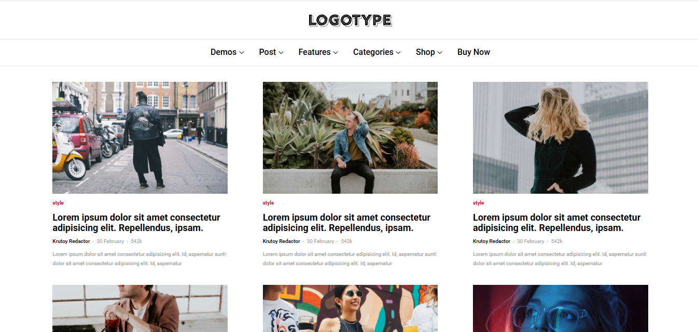

# Сайт с блогом построекный на предпроцессорах scss и pug



## Пример

Пример сайта можно посмотреть [здесь](https://1nazar1l.github.io/BlogwithPUG/dist/).

## Как подключить

Для корректной сборки проекта необходимо зайти в терминал и перейти в папку с проектом:
```
cd название_папки
```
Далее необходимо прописать следующие команды:

Установка pug-шаблонизатора( -D - это установка для разработки а не в продакшн):
```
npm install pug -D
```

Является необязательной, используется для того чтобы pug точно установился:

```
npm i pug-cli -g
```
Чтобы не указывать кто автор и т.д. при инициализации. Данная команда создает файл package.json, который необходим для сборки проекта, в нем указаны все установленные зависимости или по другому пакеты:
```
npm init -y
```
Установка сборщика webpack(нужен чтобы проект собирался):
```
npm install webpack -D
```
Необходимо для настройки webpack, писать в нем команды , сервер необходим для запуска сервера через webpack:
```
npm install webpack-cli webpack-dev-server -D
```
Будет скачан pug-plugin, который позволит работать с pug файлами в сборщике webpack:
```
npm install pug-plugin --save-dev
```
Установка css-loader:
```
npm install --save-dev css-loader
```
Установка sass-loader:
```
npm install sass-loader sass webpack --save-dev
```

## Как запустить

Чтобы запустить проект необходимо для начала проверить все эти команды:

`npm run start`: Запускает сайт на локальном хосте

`npm run dev`: Отвечает за сборку проекта в режиме разработки

`npm run build`: Отвечает за сборку проекта в режиме продакшн (финальный этап разработки, когда весь проект готов и его можно выкладывать)

`npm run clear`: Позволят очистить папку dist после сборки, если необходимо удалить все файлы

Если при запуске каждой из команд не выдало никаких ошибок значит проект настроился правильно и его можно запускать написав в консоле `npm run start`. Далее появится ссылка на локальный хост:

```cd
http://localhost:8080/
```

## Как редактировать

Основные стили изменяются в `header.scss`.

Добавление адаптации реализуется в файле `adaptive_font_scales.scss`.

`normalize.scss` нужен для нормализации стилей(Пример: обнуление внешних и внутренних отступов для элементов).

`webpack.config.js` необходим для правильной настройки для сборки проекта. Подробнее про это можно прочитать [здесь](https://habr.com/ru/articles/524260/).

